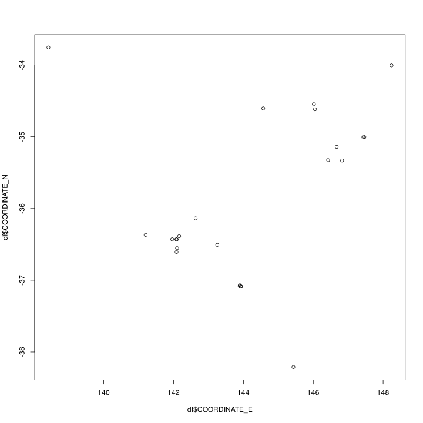
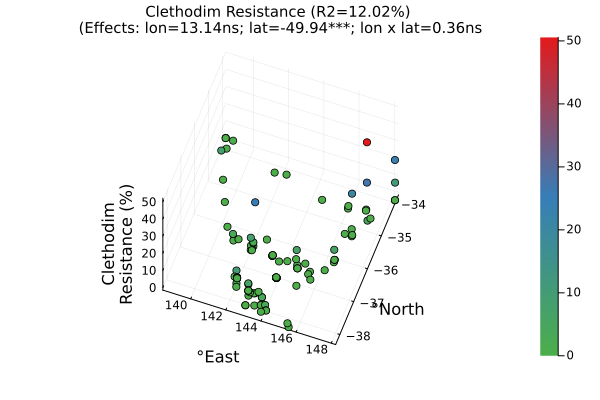
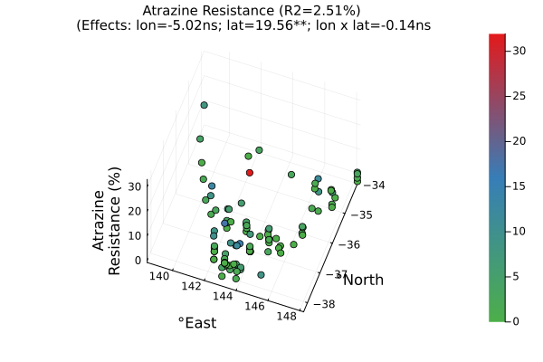
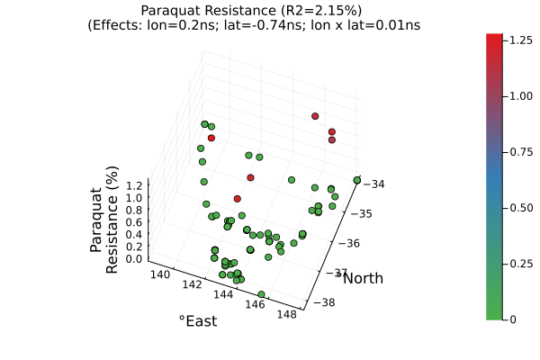
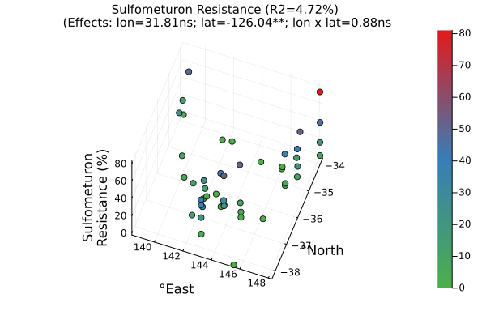
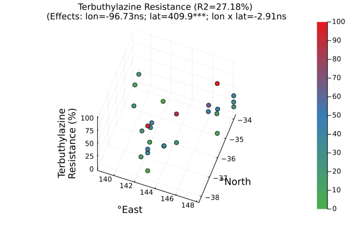

# Prototyping a quantitative and population genetics analysis of the weedomics data

## The questions we're asking and hypotheses we are testing

1. What is the distribution of hericide resistances in southeast (SE) Australia?
    - Hypotheses: *There is a lot of variation in terms of resistances and that there is more resistance for herbicides that has been around for longer and in areas with continuous cropping especially the minimum tillage areas.*
2. How are the populations genetically related - is there significant population structure across SE Australia?
    - Hypotheses: *There is not much population structure as we expect a lot of intercrossing with this highly cross-pollinating species, and also being an introduced species from an assumed small founder pool. However, there may be a gradient with the movement of machinery which potentially moves germplasm from north to south.*
3. What are the genetic architectures of herbicide resistances? How does environmental variation affect the distribution of herbicide resistances? Can we resasonably predict herbicide resistances across SE Australia using genotype and/or location data in the form of pool sequencing genomic data, edaphic, and atmospheric information?
    - Hypotheses: *We can probably reasonably predict phenotypes using genotypes while accounting for population structure to control for some spurious associations. However, the genotype data we have is not ideal as we have pool-ddRADseq data, that is at population level and only a small subset of the ~2Gb genome (i.e. ~10% o the genome) is observed. Furthermore, the phenotype data may not be the best as there is always environmental variation and imperfect genotype representaion of the observed phenotypes. Combining genomic and environmental factors to predict resistance should generate better prediction acuracies.*
4. Assuming we identify genes putatvely associated with herbicide resistances, how did these come about - did they evolve from standing genetic variation or de novo mutations, and how much is migration to blame to their distribution in the landscape?
    - Hypotheses: *Rapid adaptive evolution of herbicide resistance will probably opt for the path of least resistance, i.e. the recruitment of already extant variation to confer resistance to the stresses brought about by herbicides. Additionally, migration may play an important role in the spread of resistance genes.*
5. Can we use these data for genomic prediction and how well can we build these genomic prediction models?
    - Hypotheses: *Yes, we can build genomic prediction models using popuation level genomic and phenomic data. However, the prediction accuracies may be less than ideal.*
6. Can we predict future trajectories of herbicide resistance evolution, i.e. draw herbicide resistance distribution across SE Australia given some level of migration, and adaptaive evolution rate?
    - Hypotheses: *Yes, we can definitely try and make such a model but we will be making a lot of assumptions and make not be very accurate. However, it may be useful in developing strategies to mitigate worsening herbicide resistance in weeds.*


## 1. What is the distribution of hericide resistances in southeast (SE) Australia?

```R
library(maps)

setwd("/data-weedomics-1/poolgen/tests/misc/weedomics")
phenotypes = read.csv("Lolium_SEAU.csv")
phenotypes = phenotypes[!is.na(phenotypes$COORDINATE_E), ]
phenotypes = phenotypes[!is.na(phenotypes$COORDINATE_N), ]
x_limit = range(phenotypes$COORDINATE_E)
y_limit = range(phenotypes$COORDINATE_N)
vec_herbicides = colnames(phenotypes)[5:ncol(phenotypes)-2]
for herbi in vec_herbicides {
    # herbi = vec_herbicides[1]
    trait = eval(parse(text=paste0("phenotypes$", herbi)))
    idx = !is.na(trait)
    trait = trait[idx]
    coor_east = phenotypes$COORDINATE_E[idx]
    coor_north = phenotypes$COORDINATE_N[idx]
    df = data.frame(trait=trait, coor_east=coor_east, coor_north=coor_north)
    mod = lm(trait ~ coor_east*coor_north, data=df)
    anova = as.data.frame(anova(mod))
    coef_summary = as.data.frame(summary(mod)$coefficients)

# orig_par = par(no.readonly=TRUE)
svg("test.svg", width=18, height=15)
    # par(orig_par)
    layout(matrix(c(rep(1,5),2),nrow=1))
    par(cex=2)
    plot(0, xlim=x_limit, ylim=y_limit, asp=1, type="n", xlab="Longitude", ylab="Latitdue",
        main=paste0(herbi, " Resistance\n()"), xaxt="n", yaxt="n")
    outline = maps::map("world", plot=FALSE)
    xrange = range(outline$x, na.rm=TRUE)
    yrange = range(outline$y, na.rm=TRUE)
    xbox = xrange + c(-2, 2)
    ybox = yrange + c(-2, 2)
    ### draw the outline of the map and color the water blue
    polypath(c(outline$x, NA, c(xbox, rev(xbox))),
           c(outline$y, NA, rep(ybox, each=2)),
           col="light blue", rule="evenodd")
    
    ### plot populations coloured by their resistances
    par(new=TRUE)
    plot(0, xlim=x_limit, ylim=y_limit, asp=1, type="n", xlab="", ylab="", main="", xaxt="n", yaxt="n") #empty
    # ncolors = 25 ### 25 is a nice number to see dicrete contour lines across the landscape methinks...
    ncolors = 100
    color_gradient = rev(colorRampPalette(c("#A50026","#D73027","#F46D43","#FDAE61","#FEE08B","#FFFFBF","#D9EF8B","#A6D96A","#66BD63","#1A9850","#006837"))(ncolors))
    for (i in 1:nrow(df)){
        # i = 1
        x = df$coor_east[i]
        y = df$coor_north[i]
        z = round(df$trait[i])
        points(x, y, col=color_gradient[z], pch=19, cex=3)
    }

    ### plot heat map legend
    legend_x=seq(from=0,to=1, length=length(color_gradient))
    legend_y=seq(from=0, to=1, length=length(color_gradient))
    legend_z = matrix(rep(legend_x, times=length(color_gradient)), byrow=TRUE, nrow=length(color_gradient))
    plot(x=c(0,1), y=c(0,1), type="n", xlab="", ylab="", xaxt="n", yaxt="n", main="")
    par(new=TRUE)
    image(x=legend_x, y=legend_y, z=legend_z, col=color_gradient, xlab="", ylab="", main="", xaxt="n", las=2)
    mtext("Completely\nResistant", side=3, line=0.5, at=0.5, cex=2)
    mtext("Completely\nSusceptible", side=1, line=1.5, at=0.5, cex=2)
    ### inset histogram of resistance
    par(fig=c(0,1,0,1))
    par(fig=c(0.01, 0.4, 0.08, 0.5), cex=1, new=TRUE)
    nclass=10
    hist(trait, ylab= "", xlab="", yaxt="n", main="", nclass=nclass, 
    col=colorRampPalette(color_gradient[round(min(trait)):round(max(trait))])(nclass), bord=FALSE)
    # col=colorRampPalette(color_gradient[round(min(z_orig)*ncolors):round(max(z_orig)*ncolors)])(nclass), bord=FALSE)


dev.off()


}


```











Most herbicide resistances (except paraquat and intercept) have significant north-to-south gradient, i.e. more resistance in the north for glyphosate, clethodim, and sulfometuron; while vice-versa for atrazine and terbuthylazine.

Can we say there is more historical application of the glyphosate, clethodim and sulfometuron in the north; while more application of post-emergence photosynthesis inhibitors in the south? Is it fair to associate the higher rainfall hence more weeds in the south to the need to use faster acting photosynthesis-inhibiting herbicides?

But wait, let's try a mixed modelling approach to achieve more power. We will be using R this time


## 2. How are the populations genetically related? Is there significant population structure across SE Australia?

First, we will use the R package: `poolfstat`, then implement the same population genetics calculations in `poolgen`. So let's start with R.

```R
# install.packages("poolfstat")
library(poolfstat)

setwd("/data-weedomics-1/poolgen/tests/misc/weedomics")
phenotypes = read.csv("Lolium_SEAU.csv")
genotypes = popsync2pooldata(sync.file="Lolium_SEAU_headerless.sync", 
                             poolsize=rep(42, times=nrow(phenotypes)),
                             poolnames=phenotypes$X.POP,
                             min.cov.per.pool=1,
                             max.cov.per.pool=1e9,
                             noindel=FALSE,
                             min.maf=0.001,
                             nthreads=32)
### Assess the Fst
fst = computeFST(genotypes)
print(fst$FST)
fst_pairwise = compute.pairwiseFST(genotypes)
fst_matrix = fst_pairwise@PairwiseFSTmatrix
mean_fst = colMeans(fst_matrix, na.rm=TRUE)
h = hist(mean_fst, plot=FALSE)

svg("Fst_heatmap_unfiltered.svg", width=10, height=10)
heatmap(fst_matrix, main="Fst (unfiltered)", revC=TRUE, Rowv=NA, symm=TRUE)
dev.off()

### Remove the 2 outlier populations based on Fst and they're most probably different species as they come from a salt lake and a nature reserve
outlier_pops = names(mean_fst[order(mean_fst, decreasing=TRUE)])[1:2]
#### New phenotype dataframe
idx1 = !(phenotypes$X.POP %in% outlier_pops)
phenotypes = droplevels(phenotypes[idx1, ])
#### New Fst matrix
idx2 = !(colnames(fst_matrix) %in% outlier_pops)
fst_matrix = fst_matrix[idx2, idx2]
#### Sort the Fst matrix by population names
idx3 = order(colnames(fst_matrix))
idx4 = order(rownames(fst_matrix))
fst_matrix = fst_matrix[idx3, idx4]

svg("Fst_heatmap.svg", width=10, height=10)
heatmap(fst_matrix, main="Fst (ACC021 and ACC115 excluded)", revC=TRUE, Rowv=NA, symm=TRUE)
dev.off()

```


Now, let's just build a simple dendrogram from genotype data

```R
setwd("/data-weedomics-1/poolgen/tests/misc/weedomics")
G = read.csv("Lolium_SEAU_allele_frequencies.csv")
X = t(G[, 4:ncol(G)])
D = dist(X)

svg("cluster_genotypes.svg", width=20, height=10)
plot(hclust(D, method="complete"), hang=-1)
dev.off()

```


## 3. Can we associate the two pieces of information above to dissect the genetic bases of herbicide resistance traits?

## 4. Assuming we identify genes putatvely associated with herbicide resistance traits/s, how did these come about - did they evolve from standing genetic variation or de novo mutations, and how much is migration to blame to their distribution in the landscape?

## 5. Can we use these data for genomic prediction and how well can we build these genomic prediction models?

## 6. Can we predict future trajectories of herbicide resistance evolution, i.e. draw herbicide resistance distribution across SE Australia given some level of migration, and adaptaive evolution rate?

