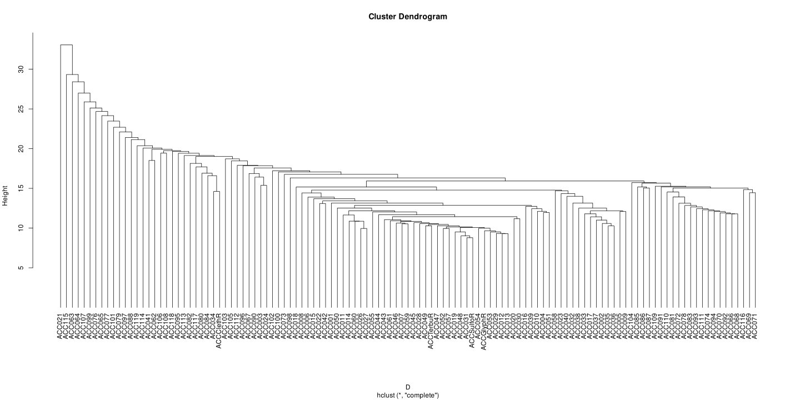
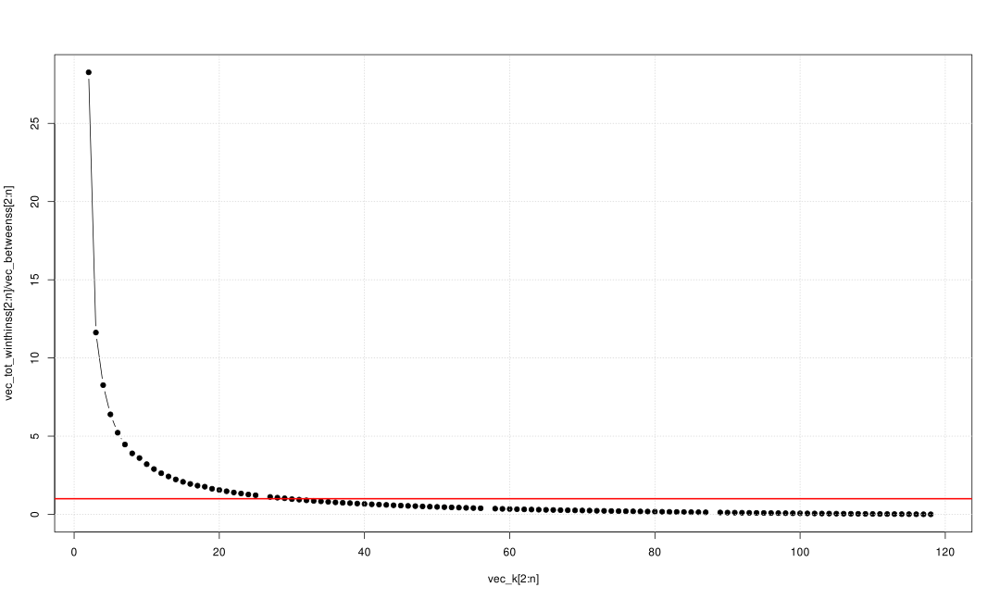
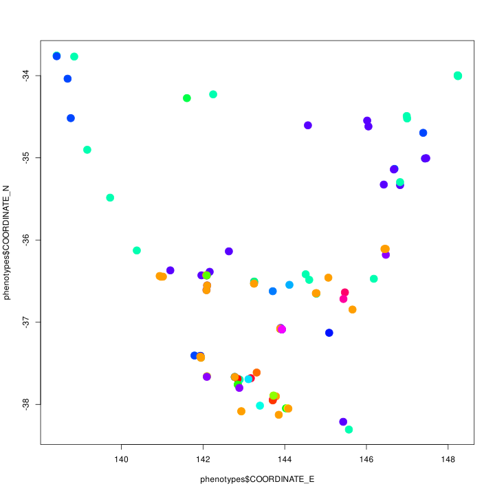

# Prototyping a quantitative and population genetics analysis of the weedomics data

## The questions we're asking and hypotheses we are testing

1. What is the distribution of hericide resistances in southeast (SE) Australia?
    - Hypotheses: *There is a lot of variation in terms of resistances and that there is more resistance for herbicides that has been around for longer and in areas with continuous cropping especially the minimum tillage areas.*
2. How are the populations genetically related - is there significant population structure across SE Australia?
    - Hypotheses: *There is not much population structure as we expect a lot of intercrossing with this highly cross-pollinating species, and also being an introduced species from an assumed small founder pool. However, there may be a gradient with the movement of machinery which potentially moves germplasm from north to south.*
3. What are the genetic architectures of herbicide resistances? How does environmental variation affect the distribution of herbicide resistances? Can we resasonably predict herbicide resistances across SE Australia using genotype and/or location data in the form of pool sequencing genomic data, edaphic, and atmospheric information?
    - Hypotheses: *We can probably reasonably predict phenotypes using genotypes while accounting for population structure to control for some spurious associations. However, the genotype data we have is not ideal as we have pool-ddRADseq data, that is at population level and only a small subset of the ~2Gb genome (i.e. ~10% o the genome) is observed. Furthermore, the phenotype data may not be the best as there is always environmental variation and imperfect genotype representaion of the observed phenotypes. Combining genomic and environmental factors to predict resistance should generate better prediction acuracies.*
4. Assuming we identify genes putatvely associated with herbicide resistances, how did these come about - did they evolve from standing genetic variation or de novo mutations, and how much is migration to blame to their distribution in the landscape?
    - Hypotheses: *Rapid adaptive evolution of herbicide resistance will probably opt for the path of least resistance, i.e. the recruitment of already extant variation to confer resistance to the stresses brought about by herbicides. Additionally, migration may play an important role in the spread of resistance genes.*
5. Can we use these data for genomic prediction and how well can we build these genomic prediction models?
    - Hypotheses: *Yes, we can build genomic prediction models using popuation level genomic and phenomic data. However, the prediction accuracies may be less than ideal.*
6. Can we predict future trajectories of herbicide resistance evolution, i.e. draw herbicide resistance distribution across SE Australia given some level of migration, and adaptaive evolution rate?
    - Hypotheses: *Yes, we can definitely try and make such a model but we will be making a lot of assumptions and make not be very accurate. However, it may be useful in developing strategies to mitigate worsening herbicide resistance in weeds.*


## 1. What is the distribution of hericide resistances in southeast (SE) Australia?

```R
library(maps)
setwd("/data-weedomics-1/poolgen/tests/misc/weedomics")
phenotypes = read.csv("Lolium_SEAU.csv")
phenotypes = phenotypes[!is.na(phenotypes$COORDINATE_E), ]
phenotypes = phenotypes[!is.na(phenotypes$COORDINATE_N), ]
x_limit = range(phenotypes$COORDINATE_E)
y_limit = range(phenotypes$COORDINATE_N)
vec_herbicides = colnames(phenotypes)[5:ncol(phenotypes)-2]
for (herbi in vec_herbicides) {
    # herbi = vec_herbicides[1]
    trait = eval(parse(text=paste0("phenotypes$", herbi)))
    idx = !is.na(trait)
    trait = trait[idx]
    coor_east = phenotypes$COORDINATE_E[idx]
    coor_north = phenotypes$COORDINATE_N[idx]
    df = data.frame(trait=trait, coor_east=coor_east, coor_north=coor_north)
    mod = lm(trait ~ coor_east*coor_north, data=df)
    coef_summary = as.data.frame(summary(mod)$coefficients)
    sig = c()
    for (i in 2:nrow(coef_summary)){
        if (coef_summary[[4]][i] < 0.001) {
            sig = c(sig, "***")
        } else if (coef_summary[[4]][i] < 0.01) {
            sig = c(sig, "**")
        } else if (coef_summary[[4]][i] < 0.05) {
            sig = c(sig, "*")
        } else {
            sig = c(sig, "ns")
        }
    }
    sig_labels = paste(paste(c("E", "N", "ExN"), sig, sep="-"), collapse=", ")
    ### PLot
    # orig_par = par(no.readonly=TRUE)
    svg(paste0(herbi, "_scatterplot.svg"), width=18, height=15)
    # par(orig_par)
    layout(matrix(c(rep(1,6),2),nrow=1))
    par(mar=c(5,5,5,0))
    par(cex=2)
    plot(0, xlim=x_limit, ylim=y_limit, asp=1, type="n", xlab="Longitude", ylab="",
        main=paste0(herbi, " Resistance\n(", sig_labels, ")"), xaxt="n", yaxt="n")
    mtext("Latitdue", side=2, padj=-6.5, cex=2) ### Fix overlapping tick labels and axis label
    grid()
    outline = maps::map("world", plot=FALSE)
    xrange = range(outline$x, na.rm=TRUE)
    yrange = range(outline$y, na.rm=TRUE)
    xbox = xrange + c(-2, 2)
    ybox = yrange + c(-2, 2)
    ### draw the outline of the map and color the water blue
    polypath(c(outline$x, NA, c(xbox, rev(xbox))),
           c(outline$y, NA, rep(ybox, each=2)),
           col="light blue", rule="evenodd")
    ### name the ticks with degree signs ("\U00B0")
    xaxis = round(seq(xrange[1], xrange[2]), 2)
    yaxis = round(seq(yrange[1], yrange[2]), 2)
    axis(side=1, at=xaxis, labels=paste0(xaxis, "\U00B0"))
    axis(side=2, at=yaxis, labels=paste0(yaxis, "\U00B0"),las=2)
    ### add a grid 'cause it looks noice
    grid(col="darkgray")
    ### plot populations coloured by their resistances
    par(new=TRUE)
    plot(0, xlim=x_limit, ylim=y_limit, asp=1, type="n", xlab="", ylab="", main="", xaxt="n", yaxt="n") #empty
    # ncolors = 25 ### 25 is a nice number to see dicrete contour lines across the landscape methinks...
    ncolors = 101
    color_gradient = rev(colorRampPalette(c("#A50026","#D73027","#F46D43","#FDAE61","#FEE08B","#FFFFBF","#D9EF8B","#A6D96A","#66BD63","#1A9850","#006837"))(ncolors))
    for (i in 1:nrow(df)){
        # i = 1
        x = df$coor_east[i]
        y = df$coor_north[i]
        z = round(df$trait[i])+1
        points(x, y, col=color_gradient[z], pch=19, cex=1.5)
    }
    ### plot heat map legend
    legend_x=seq(from=0,to=100, length=length(color_gradient))
    legend_y=seq(from=0, to=100, length=length(color_gradient))
    legend_z = matrix(rep(legend_x, times=length(color_gradient)), byrow=TRUE, nrow=length(color_gradient))
    par(mar=c(5,3,5,1))
    plot(x=c(0,100), y=c(0,100), type="n", xlab="", ylab="", xaxt="n", yaxt="n", main="")
    par(new=TRUE)
    image(x=legend_x, y=legend_y, z=legend_z, col=color_gradient, xlab="", ylab="", main="", xaxt="n", las=2)
    mtext("Completely\nResistant", side=3, line=0.5, at=0.5, cex=2)
    mtext("Completely\nSusceptible", side=1, line=1.5, at=0.5, cex=2)
    ### inset histogram of resistance
    par(mar=c(5,7,5,1))
    par(fig=c(0,1,0,1))
    par(fig=c(0.01, 0.4, 0.08, 0.5), cex=1, new=TRUE)
    nclass=10
    h = hist(trait, ylab= "", xlab="", xaxt="n", las=1, main="", nclass=nclass, 
             col=colorRampPalette(color_gradient[round(min(trait)):round(max(trait))])(nclass),
             bord=FALSE)
    xrange = round(seq(h$breaks[1], h$breaks[length(h$breaks)], len=5), 2)
    axis(side=1, at=xrange, labels=xrange, padj=-2.5)
    mtext("Resistance (%)", side=1, padj=2.5)
    dev.off()
}
```


There is no clear/sifginificant geographic gradient to the distribution of herbicide resistances across SE Australia. This probably means that herbicide resisitances are evolving from either standing genetic variation (as affected by founder effects) and *de novo* mutation (as affected by population size).

Furthermore, let' try to model landscape-wide resistance distribution just to visualise

```R
library(sf)
library(sp)
library(automap)
setwd("/data-weedomics-1/poolgen/tests/misc/weedomics")
landscape = sf::st_read("Lolium_landscape_SEAU.kml")
phenotypes = read.csv("Lolium_SEAU.csv")
phenotypes = phenotypes[!is.na(phenotypes$COORDINATE_E), ]
phenotypes = phenotypes[!is.na(phenotypes$COORDINATE_N), ]
x_limit = range(phenotypes$COORDINATE_E)
y_limit = range(phenotypes$COORDINATE_N)
vec_herbicides = colnames(phenotypes)[5:ncol(phenotypes)-2]

R = c() ### Miscellaneous: resistances matrix to make a sf object
for (herbi in vec_herbicides) {
    # herbi = vec_herbicides[1]
    x = phenotypes$COORDINATE_E
    y = phenotypes$COORDINATE_N
    z = eval(parse(text=paste0("phenotypes$", herbi)))
    idx = !is.na(z)
    x = x[idx]
    y = y[idx]
    z = z[idx]
    df_data = data.frame(x, y, z)
    df_data = df_data[!is.na(z), ]
    df_data = aggregate(z ~ x + y, data=df_data, FUN=mean)
    sp::coordinates(df_data) = ~ x + y ### Transform data.frame into and sp::SpatialPointsDataFrame
    ### Prepare the new_data to fit the kriging model built using the above training data
    df_region = as.data.frame(as.matrix(landscape$geometry[[1]]))
    colnames(df_region) = c("x", "y", "z")
    sp::coordinates(df_region) = ~ x + y ### Transform data.frame into and sp::SpatialPointsDataFrame
    ### Prepare the new_data to fit the kriging model built using the above training data
    A = sp::Polygon(df_region) ### Transform into a polygon
    B = sp::spsample(A, n=5000, type="regular") ### Sample regular intervals across the polygon to approximate its area and shape
    vec_models = c("Exp", "Sph", "Mat", "Ste") ### removing Gaus as it results in a weir interpolation of Sakura
    K1 = tryCatch(autoKrige.cv(z ~ 1, model=vec_models[1], df_data), error=function(e){autoKrige.cv(z ~ 1, df_data)})
    K2 = tryCatch(autoKrige.cv(z ~ 1, model=vec_models[2], df_data), error=function(e){autoKrige.cv(z ~ 1, df_data)})
    K3 = tryCatch(autoKrige.cv(z ~ 1, model=vec_models[3], df_data), error=function(e){autoKrige.cv(z ~ 1, df_data)})
    K4 = tryCatch(autoKrige.cv(z ~ 1, model=vec_models[4], df_data), error=function(e){autoKrige.cv(z ~ 1, df_data)})
    # K5 = tryCatch(autoKrige.cv(z ~ 1, model=vec_models[5], df_data), error=function(e){autoKrige.cv(z ~ 1, df_data)})
    K_compare = compare.cv(K1, K2, K3, K4)
    rmse = unlist(K_compare[rownames(K_compare)=="RMSE", ])
    idx = which(rmse == min(rmse))[1]
    model = vec_models[idx]
    K = tryCatch(automap::autoKrige(z ~ 1, df_data, model=model, new_data=B),
                 error=function(e) {automap::autoKrige(z ~ 1, df_data, new_data=B)}
    )
    ### Prepare the kriging output for plotting
    P = cbind(K$krige_output@coords, K$krige_output@data)[, 1:3]
    ### Set predicted resistances lesst than 0 to 0, and greater than 100 to 100
    P[P[,3] <   0, 3] = 0
    P[P[,3] > 100, 3] = 100
    colnames(P) = c("x", "y", herbi) ### coordinates from the sampled points inside the paddock polygon and the krigng-predicted weed density, z
    if (length(R) == 0) {
        R = P[, 1:3]
    } else {
        if (nrow(P) > nrow(R)) {
            R_old = R
            R = P
            R = merge(R, R_old, by=c("x", "y"), all=TRUE)
        } else {
            R = merge(R, P, by=c("x", "y"), all=TRUE)
        }
    }
    ### Prepare the colours corresponding to the herbicide resistance levels
    n_colours = 101
    vec_colours = rev(colorRampPalette(c("#A50026","#D73027","#F46D43","#FDAE61","#FEE08B","#FFFFBF","#D9EF8B","#A6D96A","#66BD63","#1A9850","#006837"))(n_colours))
    svg(paste0(herbi, "_autokrige.svg"), width=10.5, height=6.5)
    ### Plot the map
    plot(0, xlim=x_limit, ylim=y_limit, asp=1, type="n", xlab="Longitude", ylab="Latitude",
        main=paste0(herbi, " Resistance"))
    grid()
    outline = maps::map("world", plot=FALSE)
    xrange = range(outline$x, na.rm=TRUE)
    yrange = range(outline$y, na.rm=TRUE)
    xbox = xrange + c(-2, 2)
    ybox = yrange + c(-2, 2)
    ### draw the outline of the map and color the water blue
    polypath(c(outline$x, NA, c(xbox, rev(xbox))),
           c(outline$y, NA, rep(ybox, each=2)),
           col="light blue", rule="evenodd")
    ### Plot kriging-predicted weed densities across the paddock
    for (k in 1:nrow(P)){
        # k = 1
        idx = ceiling(P[k, 3]) + 1
        points(P$x[k], P$y[k], pch=15, col=vec_colours[idx])
    }
    ### Plot populations and their resistance levels
    for (i in 1:length(x)) {
        idx = ceiling(z[i]) + 1
        points(x[i], y[i], col="gray", bg=vec_colours[idx], pch=21)
    }
    ### Append the best-fit Kriging model
    text(x=x_limit[1], y=y_limit[1], paste0("Kriging model: ", model), pos=4)
    ### Heatmap legend
    # par(fig=c(0.01, 0.4, 0.1, 0.5), cex=1, new=TRUE)
    par(fig=c(0.77,0.97,0.3,0.5), new=TRUE)
    par(mar=c(0,1,1,1))
    nclass=10
    plot(0, ylab= "", xlab="", xaxt="n", yaxt="n", type="n")
    par(new=TRUE)
    df_table = data.frame(bins=seq(0, 100, length=11), counts=rep(0, times=11))
    for (i in 2:nrow(df_table)) {
        # i = 2
        df_table[i, 2] = sum((z >= df_table[i-1, 1]) & (z < df_table[i, 1]))
    }
    barplot(df_table$counts[2:nrow(df_table)], col=vec_colours[seq(1, n_colours, length=nclass)], bord=FALSE, las=1)
    par(fig=c(0.77,0.97,0.27,0.29), new=TRUE)
    par(mar=c(0,1,0,1))
    h = hist(seq(0,100, length=10), ylab= "", xlab="", xaxt="n", yaxt="n", las=1, main="", nclass=nclass, 
             col=vec_colours[seq(1, n_colours, length=10)],
             bord=FALSE)
    xrange = round(seq(h$breaks[1], h$breaks[length(h$breaks)], len=5), 2)
    axis(side=1, at=xrange, labels=xrange, padj=-1)
    mtext("Resistance (%)", side=1, padj=2.5)
    dev.off()
}

### Miscellaneous: create an sf object
### Find the distances between sampled points
dx = mean(diff(sort(unique(R$x))))
dy = mean(diff(sort(unique(R$y))))
### Create qadrilaterals (squares in this case since we sampled in regular intervals from the A, i.e. the landscape)
Q = lapply(1:nrow(R), function(i){
  M = matrix(c(R$x[i],    R$y[i],
               R$x[i],    R$y[i]+dy,
               R$x[i]+dx, R$y[i]+dy,
               R$x[i]+dx, R$y[i],
               R$x[i],    R$y[i])
         , ncol =2, byrow = T
  )
  st_polygon(list(M))
})

header_herbicides = colnames(R)[3:ncol(R)]
eval(parse(text=paste0("SF_OBJECT = st_sf(", paste(paste0(header_herbicides, "= R$", header_herbicides), collapse=", "), ", st_sfc(Q))")))
SF_OBJECT ### Can be saved into shapefile but the herbicide names will be trucated because of the inherent restrictions in the file format
```


## 2. How are the populations genetically related? Is there significant population structure across SE Australia?

First, we will use the R package: `poolfstat`, then implement the same population genetics calculations in `poolgen`. So let's start with R.

```R
# install.packages("poolfstat")
library(poolfstat)

setwd("/data-weedomics-1/poolgen/tests/misc/weedomics")
phenotypes = read.csv("Lolium_SEAU.csv")
genotypes = popsync2pooldata(sync.file="Lolium_SEAU_headerless.sync", 
                             poolsize=rep(42, times=nrow(phenotypes)),
                             poolnames=phenotypes$X.POP,
                             min.cov.per.pool=1,
                             max.cov.per.pool=1e9,
                             noindel=FALSE,
                             min.maf=0.001,
                             nthreads=32)
### Assess the Fst
fst = computeFST(genotypes)
print(fst$FST)
fst_pairwise = compute.pairwiseFST(genotypes)
fst_matrix = fst_pairwise@PairwiseFSTmatrix
mean_fst = colMeans(fst_matrix, na.rm=TRUE)
h = hist(mean_fst, plot=FALSE)

#### Sort the Fst matrix by population names
idx = order(colnames(fst_matrix))
fst_matrix = fst_matrix[idx, idx]

svg("Fst_heatmap_unfiltered.svg", width=10, height=10)
heatmap(fst_matrix, main="Fst (unfiltered)", revC=TRUE, Rowv=NA, symm=TRUE)
dev.off()

### Remove the 2 outlier populations based on Fst and they're most probably different species as they come from a salt lake and a nature reserve
outlier_pops = names(mean_fst[order(mean_fst, decreasing=TRUE)])[1:2]
#### New phenotype dataframe
idx1 = !(phenotypes$X.POP %in% outlier_pops)
phenotypes = droplevels(phenotypes[idx1, ])
#### New Fst matrix
idx2 = !(colnames(fst_matrix) %in% outlier_pops)
fst_matrix = fst_matrix[idx2, idx2]


svg("Fst_heatmap.svg", width=10, height=10)
heatmap(fst_matrix, main="Fst (ACC021 and ACC115 excluded)", revC=TRUE, Rowv=NA, symm=TRUE)
dev.off()

```


These 2 outliers come from park areas, phenotypically (eyeballing it) different from the field-collected populations, and are most probably different species. I will therefore convert the pileups into syncs excluding these 2 populations, i.e. ACC021 and ACC115.

```shell
# cd /data/weedomics/2.c_60_populations_genotyping/READ_LINKS
# grep -n "ACC21\|ACC115" bamlist-Lolium_SEAU.txt ### Entries 61 an 76
# head Lolium_SEAU.pileup | cut -f1-5
# time cut -f1-183,187-228,232-360 Lolium_SEAU.pileup > Lolium_SEAU_filteredout_ACC021_and_ACC115.pileup
cd /data-weedomics-1/poolgen/tests/misc/weedomics
time poolgen-dev fst \
    -f Lolium_SEAU_filteredout_ACC021_and_ACC115.sync \
    -p Lolium_SEAU_filteredout_ACC021_and_ACC115.csv \
    -o Lolium_SEAU_filteredout_ACC021_and_ACC115.fst \
    --n-threads 32
```

Now, re-draw the Fst heatmap

```R
setwd("/data-weedomics-1/poolgen/tests/misc/weedomics")
dat = read.csv("Lolium_SEAU_filteredout_ACC021_and_ACC115.fst")
fst_matrix = as.matrix(dat[,2:ncol(dat)])
rownames(fst_matrix) = colnames(fst_matrix)
idx = order(colnames(fst_matrix))
fst_matrix = fst_matrix[idx, idx]
svg("Fst_heatmap_filtered.svg", width=10, height=10)
heatmap(fst_matrix, main="Fst filtered (poolgen)", revC=TRUE, Rowv=NA, symm=TRUE)
dev.off()
```


Also, let's see the heterozygosity of each population, i.e. the nucleotide diversity within each population:

```shell
cd /data-weedomics-1/poolgen/tests/misc/weedomics
time poolgen-dev heterozygosity \
    -f Lolium_SEAU_filteredout_ACC021_and_ACC115.sync \
    -p Lolium_SEAU_filteredout_ACC021_and_ACC115.csv \
    -o Lolium_SEAU_filteredout_ACC021_and_ACC115.pi \
    --n-threads 32
```

Let's take a look:

```R
setwd("/data-weedomics-1/poolgen/tests/misc/weedomics")
dat = read.csv("Lolium_SEAU_filteredout_ACC021_and_ACC115.pi")
PI = dat[,2]
rownames(PI) = dat$Pool
svg("Heterozygosity_barplot_filtered.svg", width=10, height=10)
barplot

``

Now, let's just build a simple dendrogram from genotype data

```R
setwd("/data-weedomics-1/poolgen/tests/misc/weedomics")
G = read.csv("Lolium_SEAU_allele_frequencies.csv")
X = t(G[, 4:ncol(G)])
D = dist(X)

svg("cluster_genotypes.svg", width=20, height=10)
plot(hclust(D, method="complete"), hang=-1)
dev.off()
```




Let's also try and cluster these populations and see if there's any geographic correlation.

```R
library(parallel)
t = detectCores() - 1
setwd("/data-weedomics-1/poolgen/tests/misc/weedomics")
phenotypes = read.csv("Lolium_SEAU.csv")
G = read.csv("Lolium_SEAU_allele_frequencies.csv")
X = t(G[, 4:ncol(G)])
n = nrow(X)
p = ncol(X)
vec_k = c(1:n)
K = mclapply(vec_k, function(k) {
       kmeans(X, centers=k)
   }, mc.cores=t)

vec_clusters = c()
vec_totss = c()
vec_tot_winthinss = c()
vec_betweenss = c()
for (i in vec_k) {
    vec_clusters = c(vec_clusters, tryCatch(K[[i]]$cluster
                    , error = function(e) {NA}))
    vec_totss = c(vec_totss, tryCatch(K[[i]]$totss
                    , error = function(e) {NA}))
    vec_tot_winthinss = c(vec_tot_winthinss, tryCatch(K[[i]]$tot.withinss
                    , error = function(e) {NA}))
    vec_betweenss = c(vec_betweenss, tryCatch(K[[i]]$betweenss
                    , error = function(e) {NA}))
}

vec_within_over_between = vec_tot_winthinss/vec_betweenss
idx = order(abs(vec_within_over_between-1), decreasing=FALSE) # NAs at the end
k_optimal = vec_k[idx][1]

svg("kmeans_clustering_finding_the_best_k.svg", width=15, height=9)
plot(x=vec_k[2:n], y=vec_tot_winthinss[2:n]/vec_betweenss[2:n], type="b", pch=19)
grid()
abline(h=1.0, col="red", type=2, lwd=2)
dev.off()

# # test k=3
# k_optimal = 3

clusters = data.frame(X.POP=names(K[[k_optimal]]$cluster), cluster=K[[k_optimal]]$cluster)
phenotypes = merge(phenotypes, clusters, by="X.POP")
cluster_colours = rainbow(k_optimal)
# Q = phenotypes
# phenotypes = phenotypes[61:nrow(phenotypes), ]

svg("kmeans_clusters.svg", width=10, height=10)
plot(x=phenotypes$COORDINATE_E, y=phenotypes$COORDINATE_N,
     col=cluster_colours[phenotypes$cluster], pch=19, cex=2)
text(x=phenotypes$COORDINATE_E,
     y=phenotypes$COORDINATE_N,
     lab=phenotypes$X.POP, pos=3)
dev.off()


```




## 3. What are the genetic architectures of herbicide resistances? How does environmental variation affect the distribution of herbicide resistances? Can we resasonably predict herbicide resistances across SE Australia using genotype and/or location data in the form of pool sequencing genomic data, edaphic, and atmospheric information?

## 4. Assuming we identify genes putatvely associated with herbicide resistances, how did these come about - did they evolve from standing genetic variation or de novo mutations, and how much is migration to blame to their distribution in the landscape?

## 5. Can we use these data for genomic prediction and how well can we build these genomic prediction models?

## 6. Can we predict future trajectories of herbicide resistance evolution, i.e. draw herbicide resistance distribution across SE Australia given some level of migration, and adaptaive evolution rate?
