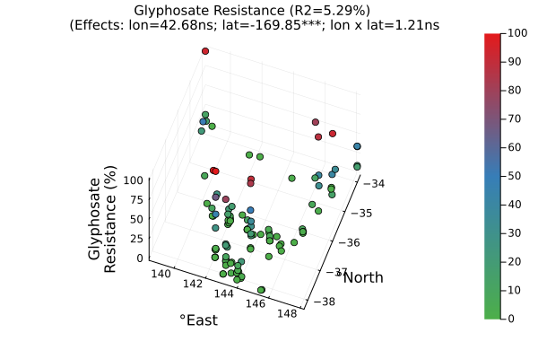

# Prototyping a quantitative and population genetics analysis of the weedomics data

## The questions we're asking and hypotheses we are testing

1. What is the distribution of hericide resistances in southeast (SE) Australia?
    - Hypotheses: *There is a lot of variation in terms of resistances and that there is more resistance for herbicides that has been around for longer and in areas with continuous cropping especially the minimum tillage areas.*
2. How are the populations genetically related - is there significant population structure across SE Australia?
    - Hypotheses: *There is not much population structure as we expect a lot of intercrossing with this highly cross-pollinating species, and also being an introduced species from an assumed small founder pool. However, there may be a gradient with the movement of machinery which potentially moves germplasm from north to south.*
3. Can we associate the two pieces of information above to dissect the genetic bases of herbicide resistance traits?
    - Hypotheses: *Yes, we can associate genotypes to phenotypes while accounting for population structure to control for some spurious associations. However, the genotype data we have is not ideal as we have pool-ddRADseq data, that is at population level and only a small subset of the ~2Gb genome (i.e. ~10% o the genome) is observed. Furthermore, the phenotype data may not be the best as there is always environmental variation and imperfect genotype representaion of the observed phenotypes.*
4. Assuming we identify genes putatvely associated with herbicide resistance traits/s, how did these come about - did they evolve from standing genetic variation or de novo mutations, and how much is migration to blame to their distribution in the landscape?
    - Hypotheses: *Rapid adaptive evolution of herbicide resistance will probably opt for the path of least resistance, i.e. the recruitment of already extant variation to confer resistance to the stresses brought about by herbicides. Additionally, migration may play an important role in the spread of resistance genes.*
5. Can we use these data for genomic prediction and how well can we build these genomic prediction models?
    - Hypotheses: *Yes, we can build genomic prediction models using popuation level genomic and phenomic data. However, the prediction accuracies may be less than ideal.*
6. Can we predict future trajectories of herbicide resistance evolution, i.e. draw herbicide resistance distribution across SE Australia given some level of migration, and adaptaive evolution rate?
    - Hypotheses: *Yes, we can definitely try and make such a model but we will be making a lot of assumptions and make not be very accurate. However, it may be useful in developing strategies to mitigate worsening herbicide resistance in weeds.*

## Setting up our working directory and decided that we will be using Julia for this prototype analysis workflow

Setup our working directory and download Julia 1.9

```shell
### Set working directory
DIR=/data-weedomics-1/poolgen/tests/misc/weedomics
cd $DIR

### Convert the sync into a csv file excluding the major allele
time poolgen sync2csv \
    -f Lolium_SEAU.sync \
    --phen-fname Lolium_SEAU.csv \
    --keep-p-minus-1 \
    --output Lolium_SEAU_allele_frequencies.csv \
    --n-threads 32

### Download Julia 1.9
wget https://julialang-s3.julialang.org/bin/linux/x64/1.9/julia-1.9.0-linux-x86_64.tar.gz
tar zxvf julia-1.9.0-linux-x86_64.tar.gz
rm julia-1.9.0-linux-x86_64.tar.gz
sudo ln -s ${DIR}/julia-1.9.0/bin/julia /usr/bin/julia1.9
```

Install linear algebra, statistics, progress meter, and plotting libraries in Julia 1.9

```julia
using Pkg
Pkg.add("DataFrames")
Pkg.add("CSV")
Pkg.add("LinearAlgebra")
Pkg.add("Statistics")
Pkg.add("ProgressMeter")
Pkg.add("Plots")
```

Load the libraries we need and our dataset

```julia
using DataFrames
using CSV
using LinearAlgebra
using Statistics
using Distributions
using ProgressMeter
using Plots
using Colors
# using Unitful
# using UnicodePlots

cd("/data-weedomics-1/poolgen/tests/misc/weedomics")
G = CSV.read("Lolium_SEAU_allele_frequencies.csv", DataFrames.DataFrame; header=true)
Y = CSV.read("Lolium_SEAU.csv", DataFrames.DataFrame; header=true)

vec_populations = names(G)[4:ncol(G)]
vec_herbicides = names(Y)[3:(ncol(Y)-2)]
```

## 1. What is the distribution of hericide resistances in southeast (SE) Australia?

```julia
herbicide = vec_herbicides[1]

# Subset
jdx = names(Y).== herbicide
jdx[end-1:end] .= true ### include the coordinates
p = Y[:, jdx]
idx = .!ismissing.(p[:,1])
p = p[idx, :]
y = convert(Array{Float64}, p[:,1])
coordinate_north = convert(Array{Float64}, p[:,2])
coordinate_east = convert(Array{Float64}, p[:,3])
n = length(coordinate_north)

# Metrics
X = hcat(ones(n), coordinate_east, coordinate_north, coordinate_east .* coordinate_north)
inv_XTX = pinv(X' * X)
B = inv_XTX * X' * y
y_hat = X * B
epsilon = y - y_hat
ss_total = sum((y .- mean(y)).^2)
ss_error = sum(epsilon.^2)
ms_error = ss_error / (n-size(inv_XTX, 1))
sd_betas = Float64[]
for i in 1:size(inv_XTX, 1)
    push!(sd_betas, sqrt(ms_error*inv_XTX[i,i]))
end
min_y = minimum(y)
max_y = maximum(y)
mean_y = mean(y)
median_y = median(y)
var_y = var(y)
Tdist = Distributions.TDist(n-size(inv_XTX, 1))
significance_of_effect_from_west_to_east = Distributions.pdf(Tdist, B[2]/sd_betas[3])
significance_of_effect_from_south_to_north = Distributions.pdf(Tdist, B[3]/sd_betas[2])
significance_of_effect_of_specific_position = Distributions.pdf(Tdist, B[4]/sd_betas[4])
R2 = (1 - (ss_error/ss_total)) * 100

# Plot
plot_3d = Plots.scatter(coordinate_east,
                        coordinate_north,
                        y,
                        zcolor = y,
                        c = cgrad(:Set1_3, n, rev=true),
                        camera = (20, 60),
                        title = string(herbicide,
                                " Resistance\n(Effects: lon=", round(B[2], digits=2),
                                "; lat=", round(B[3], digits=2),
                                "; lon x lat=", round(B[4], digits=2)),
                        xlab="°East", ylab="°North", zlab=string(herbicide, "\nResistance (%)"));
Plots.savefig(string(herbicide, "_scatterplot3d.svg"))


```




There is not much gradient in the the distribution of herbicide resistances across SE Australia. Resistances seem to be just scattered throughout the landscape with little north-to-south gradient.

## 2. How are the populations genetically related - is there significant population structure across SE Australia?

## 3. Can we associate the two pieces of information above to dissect the genetic bases of herbicide resistance traits?

## 4. Assuming we identify genes putatvely associated with herbicide resistance traits/s, how did these come about - did they evolve from standing genetic variation or de novo mutations, and how much is migration to blame to their distribution in the landscape?

## 5. Can we use these data for genomic prediction and how well can we build these genomic prediction models?

## 6. Can we predict future trajectories of herbicide resistance evolution, i.e. draw herbicide resistance distribution across SE Australia given some level of migration, and adaptaive evolution rate?

